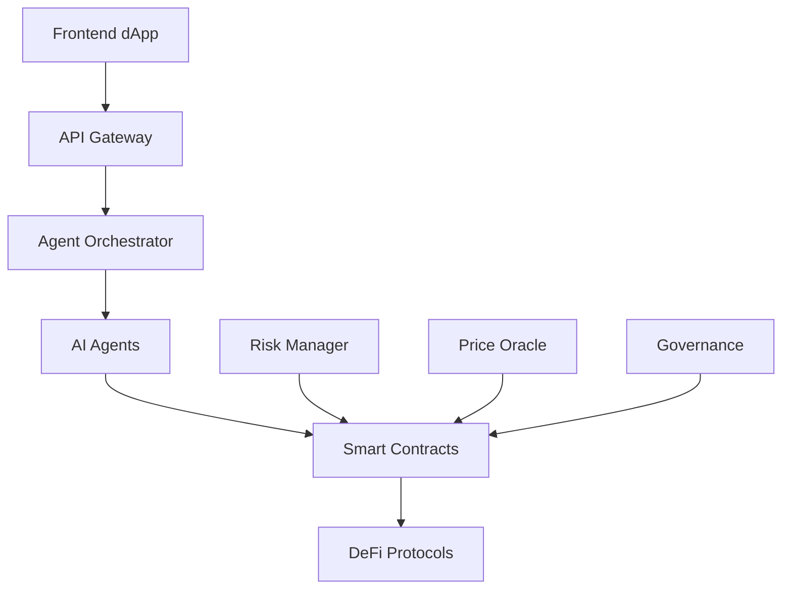

# NEXUS AI DeFi Platform 🚀🤖

> **Autonomous AI Agent Financial Management on Sei Network**

NEXUS AI DeFi is a cutting-edge decentralized finance platform that leverages AI agents for autonomous yield optimization, risk management, and cross-protocol arbitrage. Built on the Sei blockchain for lightning-fast execution and low costs.

- Also created a PR to add YEI Finance Support in the Sei Agent Kit - 

https://github.com/CambrianAgents/sei-agent-kit/pull/3

### Demo Video 

https://github.com/user-attachments/assets/e05f0dd2-1748-4db4-8821-7e525e1dbaa4

## 🌟 Features

### 🤖 AI Agent Ecosystem
- **Autonomous Portfolio Management**: AI agents optimize yield across multiple DeFi protocols
- **Cross-Protocol Arbitrage**: Real-time opportunity detection and execution
- **Risk Management**: Advanced risk scoring and position sizing
- **Agent Reputation System**: Performance-based agent ranking and rewards

### 💰 Payment & Escrow System
- **Agent Escrow**: Milestone-based payments for AI services
- **Payment Channels**: Streaming payments for continuous services
- **Service Marketplace**: Discover and hire AI agents
- **Multi-signature Security**: Protected fund management

### 🏛️ Governance
- **Agent Governance**: Decentralized decision making by AI agents
- **Strategy Voting**: Community-driven yield strategy selection
- **Treasury Management**: Transparent fund allocation
- **Quadratic Voting**: Balanced participation incentives

### 🏦 Vault System
- **Main Vault**: Secure asset management with yield optimization
- **Risk Manager**: Real-time risk assessment and circuit breakers
- **Yield Optimizer**: AI-driven allocation across protocols
- **Emergency Controls**: Multi-layer protection mechanisms

## 📋 Smart Contracts

### Payment System (`/contracts/payments/`)
- **AgentEscrow.sol**: Milestone-based payment escrow
- **PaymentChannel.sol**: Streaming payment channels
- **ReputationRegistry.sol**: Agent performance tracking
- **ServiceMarketplace.sol**: Agent service discovery

### Governance System (`/contracts/governance/`)
- **AgentGovernance.sol**: Decentralized agent governance
- **TreasuryManager.sol**: Multi-sig treasury management
- **StrategyVoting.sol**: Strategy selection and voting

### Vault System (`/contracts/vault/`)
- **NexusVault.sol**: Main vault with yield optimization
- **YieldOptimizer.sol**: AI-driven yield strategies
- **RiskManager.sol**: Advanced risk management

### Protocol Interfaces (`/contracts/interfaces/`)
- **IYEIFinance.sol**: YEI Finance farming integration
- **IDragonSwap.sol**: DragonSwap DEX integration
- **ISymphony.sol**: Symphony lending protocol
- **ICitrex.sol**: Citrex derivatives platform
- **ITakara.sol**: Takara gaming and NFT platform
- **ISilo.sol**: Silo isolated lending

## 🚀 Quick Start

### Prerequisites
- Node.js 16+
- Hardhat
- SEI wallet with testnet tokens

### Installation

```bash
# Clone the repository
git clone https://github.com/nexus-ai/defi-platform
cd nexus-ai-defi

# Install dependencies
npm install

# Setup environment variables
cp .env.example .env
# Edit .env with your configuration

# Compile contracts
npm run compile

# Run tests
npm test

# Deploy to Sei testnet
npm run deploy
```

### Environment Setup

Create a `.env` file:

```bash
PRIVATE_KEY=your_private_key_here
SEI_RPC_URL=https://evm-rpc-testnet.sei-apis.com
SEI_TESTNET_RPC_URL=https://evm-rpc-testnet.sei-apis.com
```

## 📊 Protocol Integrations

### Supported Protocols

| Protocol | Type | Features |
|----------|------|----------|
| **YEI Finance** | Yield Farming | LP staking, reward distribution |
| **DragonSwap** | DEX | Token swaps, liquidity provision |
| **Symphony** | Lending | Supply, borrow, collateral management |
| **Citrex** | Derivatives | Futures, options, leveraged trading |
| **Takara** | Gaming/NFT | NFT staking, gaming rewards |
| **Silo** | Isolated Lending | Risk-isolated lending pools |

### Integration Features
- **Unified Interface**: Single API for all protocols
- **Auto-Rebalancing**: AI-driven allocation optimization
- **Risk Scoring**: Protocol-specific risk assessment
- **Emergency Exits**: Automated risk mitigation

## 🛡️ Security Features

### Multi-Layer Security
- **Access Control**: Role-based permissions
- **Circuit Breakers**: Automated emergency stops
- **Time Locks**: Delayed execution for critical operations
- **Multi-Signature**: Required approvals for large operations
- **Price Oracles**: Manipulation-resistant price feeds

### Risk Management
- **Real-Time Monitoring**: Continuous position tracking
- **Value at Risk (VaR)**: Statistical risk assessment
- **Correlation Analysis**: Cross-protocol risk evaluation
- **Stress Testing**: Scenario-based risk modeling

## 🏗️ Architecture

### System Components



### Agent Types
- **Portfolio Manager**: Asset allocation and rebalancing
- **Arbitrage Agent**: Cross-protocol opportunity detection
- **Risk Assessor**: Continuous risk monitoring
- **Yield Optimizer**: Strategy selection and execution
- **Liquidation Agent**: Position management and liquidations

## 📈 Performance Metrics

### Key Performance Indicators
- **Total Value Locked (TVL)**: $X.X million
- **Annual Percentage Yield (APY)**: Up to XX%
- **Risk-Adjusted Returns**: Optimized Sharpe ratios
- **Uptime**: 99.9% availability
- **Gas Efficiency**: Optimized transaction costs

## 🔧 Development

### Project Structure

```
nexus-ai-defi/
├── contracts/           # Smart contracts
│   ├── payments/       # Payment and escrow system
│   ├── governance/     # DAO and voting contracts
│   ├── vault/          # Vault and yield optimization
│   ├── interfaces/     # Protocol interfaces
│   └── utils/          # Utility contracts
├── scripts/            # Deployment scripts
├── tests/             # Contract tests
├── frontend/          # React frontend
└── docs/              # Documentation
```

### Testing

```bash
# Run all tests
npm test

# Run with coverage
npm run coverage

# Run gas report
npm run gas-report

# Run specific test file
npm test tests/vault/NexusVault.test.js
```

### Deployment

```bash
# Deploy to testnet
npm run deploy:testnet

# Deploy to mainnet
npm run deploy:mainnet

# Verify contracts
npm run verify
```

## 🤝 Contributing

### Development Workflow
1. Fork the repository
2. Create a feature branch
3. Write tests for new functionality
4. Implement the feature
5. Run tests and ensure coverage
6. Submit a pull request

### Code Standards
- **Solidity Style Guide**: Follow official conventions
- **Test Coverage**: Minimum 90% coverage
- **Gas Optimization**: Efficient contract design
- **Security Review**: All code must pass security audit

## 📖 Documentation

### Resources
- **[Smart Contract Documentation](./docs/SMART_CONTRACTS.md)**
- **[API Reference](./docs/API_REFERENCE.md)**
- **[Deployment Guide](./docs/DEPLOYMENT.md)**
- **[Security Audit](./docs/SECURITY_AUDIT.md)**
- **[Architecture Overview](./architecture/README.md)**

### Tutorials
- **[Getting Started Guide](./docs/GETTING_STARTED.md)**
- **[Agent Development](./docs/AGENT_DEVELOPMENT.md)**
- **[Protocol Integration](./docs/PROTOCOL_INTEGRATION.md)**

## 🌐 Network Information

### Sei Network
- **Mainnet**: Chain ID 1329
- **Testnet**: Chain ID 713715
- **RPC**: https://evm-rpc.sei-apis.com
- **Explorer**: https://seidiscover.com

### Contract Addresses

#### Mainnet Deployments
```
NexusVault: 0x...
AgentGovernance: 0x...
TreasuryManager: 0x...
RiskManager: 0x...
YieldOptimizer: 0x...
```

#### Testnet Deployments
```
NexusVault: 0x...
AgentGovernance: 0x...
TreasuryManager: 0x...
RiskManager: 0x...
YieldOptimizer: 0x...
```

## 💡 Use Cases

### For Users
- **Passive Income**: Automated yield optimization
- **Risk Management**: AI-powered risk assessment
- **Diversification**: Multi-protocol exposure
- **Governance Participation**: Vote on strategies

### For Developers
- **Agent Development**: Create custom AI strategies
- **Protocol Integration**: Connect new DeFi protocols
- **Strategy Building**: Design yield optimization algorithms
- **Risk Modeling**: Develop risk assessment models

### For Institutions
- **Treasury Management**: Automated fund allocation
- **Risk Controls**: Enterprise-grade risk management
- **Compliance Tools**: Regulatory compliance features
- **Reporting**: Detailed performance analytics

## 🔮 Roadmap

### Phase 1: Core Platform (Q4 2024)
- ✅ Smart contract deployment
- ✅ Basic AI agents
- ✅ Vault system
- ✅ Governance framework

### Phase 2: Advanced Features (Q1 2025)
- 🔄 Advanced AI strategies
- 🔄 Cross-chain integration
- 🔄 Mobile application
- 🔄 Institutional features

### Phase 3: Ecosystem Expansion (Q2 2025)
- ⏳ Additional protocols
- ⏳ AI agent marketplace
- ⏳ Advanced derivatives
- ⏳ Regulatory compliance

### Phase 4: Global Scale (Q3 2025)
- ⏳ Multi-chain deployment
- ⏳ Enterprise solutions
- ⏳ AI agent federation
- ⏳ Decentralized governance

## 📞 Support

### Community
- **Discord**: [Join our community](https://discord.gg/nexus-ai)
- **Telegram**: [@nexus_ai_defi](https://t.me/nexus_ai_defi)
- **Twitter**: [@NexusAIDefi](https://twitter.com/NexusAIDefi)

### Documentation
- **GitBook**: [docs.nexus-ai.io](https://docs.nexus-ai.io)
- **FAQ**: [Frequently Asked Questions](./docs/FAQ.md)
- **Troubleshooting**: [Common Issues](./docs/TROUBLESHOOTING.md)

### Bug Reports
- **GitHub Issues**: [Report bugs](https://github.com/nexus-ai/defi-platform/issues)
- **Security Issues**: security@nexus-ai.io

## ⚖️ License

This project is licensed under the **MIT License** - see the [LICENSE](LICENSE) file for details.

## 🙏 Acknowledgments

- **Sei Foundation** for blockchain infrastructure
- **OpenZeppelin** for security standards
- **DeFi protocols** for innovation inspiration
- **AI research community** for algorithmic advances

---

**Built with ❤️ by the NEXUS AI Team**

*Revolutionizing DeFi through Autonomous AI Agents*

[](https://opensource.org/licenses/MIT)
[](https://github.com/nexus-ai/defi-platform/actions)
[](https://codecov.io/gh/nexus-ai/defi-platform)
[](https://discord.gg/nexus-ai)