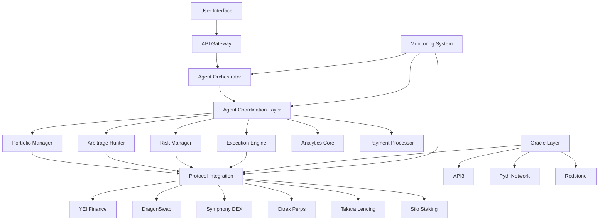

# NEXUS AI DeFi Platform - Complete Architecture Documentation

## 🏗️ Architecture Overview

The NEXUS AI DeFi Platform is a production-ready, autonomous multi-agent system designed for decentralized finance operations on the Sei blockchain. This comprehensive architecture enables AI agents to collaborate, transact, and optimize DeFi strategies while maintaining security, scalability, and real-time performance.

## 📋 Architecture Components

### Core Architecture Documents

1. **[System Architecture](./system-architecture.md)**
   - High-level system design and component interactions
   - Scalable microservices architecture with Docker containers
   - Kubernetes orchestration for production deployment
   - Multi-layer security and performance optimization

2. **[Agent Coordination Layer](./agent-coordination-layer.md)**
   - Central orchestration hub for agent lifecycle management
   - Redis pub/sub message bus for real-time communication
   - Byzantine Fault Tolerant consensus engine
   - Task distribution and load balancing systems

3. **[Protocol Integration Layer](./protocol-integration-layer.md)**
   - Standardized adapters for major Sei DeFi protocols
   - YEI Finance, DragonSwap, Symphony DEX integration
   - Citrex perpetuals and Takara lending support
   - Silo staking and governance participation

4. **[Payment System Architecture](./payment-system-architecture.md)**
   - State channel network for instant agent payments
   - Smart contract escrow for conditional transactions
   - Micropayment infrastructure for frequent small payments
   - Performance-based payment engine with reputation scoring

5. **[Risk Management Framework](./risk-management-framework.md)**
   - Real-time risk assessment and portfolio analysis
   - Circuit breaker system for extreme market conditions
   - Dynamic position sizing and liquidation protection
   - Comprehensive stress testing and scenario analysis

6. **[Monitoring System Architecture](./monitoring-system-architecture.md)**
   - Multi-layer monitoring stack (infrastructure, application, business)
   - Real-time dashboards and intelligent alert management
   - Performance analytics and bottleneck detection
   - Security monitoring and incident response

7. **[Smart Contract Interfaces](./smart-contract-interfaces.md)**
   - Agent registry contract with reputation management
   - Payment channel contracts for instant transactions
   - Escrow contracts for conditional payments
   - Risk management and oracle integration contracts

8. **[Data Structures](./data-structures.md)**
   - Comprehensive type definitions and interfaces
   - Agent, task, and workflow data structures
   - Market data and financial calculation types
   - Monitoring and analytics data models

9. **[Deployment Architecture](./deployment-architecture.md)**
   - Multi-cloud deployment strategy with disaster recovery
   - Kubernetes cluster configuration and auto-scaling
   - CI/CD pipeline with security scanning
   - Production operational procedures

## 🎯 Key Architecture Principles

### 1. **Agent-Centric Design**
```typescript
// Every component is an autonomous agent
interface Agent {
  id: string;
  capabilities: Capability[];
  communicate: (message: Message) => Promise<Response>;
  execute: (task: Task) => Promise<Result>;
}
```

### 2. **Real-Time Coordination**
- Sub-second latency for arbitrage opportunities
- WebSocket connections for live data feeds
- Redis pub/sub for agent coordination

### 3. **Security-First Architecture**
- Multi-signature wallets for large transactions
- Circuit breakers for risk management
- Encrypted agent-to-agent communication

### 4. **Scalable Infrastructure**
- Microservices with Docker containers
- Kubernetes orchestration
- Auto-scaling based on market volatility

## 🔗 System Integration Flow



## 🚀 Deployment Architecture Summary

### Production Infrastructure
- **Primary Cloud**: AWS (us-west-2, us-east-1)
- **Secondary Cloud**: GCP (us-central1, europe-west1)
- **Disaster Recovery**: Multi-region with automated failover
- **Container Orchestration**: Kubernetes with auto-scaling
- **Service Mesh**: Istio for secure service communication

### Key Components Scaling
```yaml
Components:
  Agent Orchestrator: 3 replicas (up to 10)
  Portfolio Managers: 5 replicas (up to 20)
  Arbitrage Hunters: 8 replicas (up to 50)
  Risk Managers: 3 replicas (up to 15)
  Execution Engines: 10 replicas (up to 100)
  Analytics Core: 4 replicas (up to 20)
  Payment Processors: 3 replicas (up to 15)
```

## 💰 Financial Architecture Highlights

### Agent Economic Model
- **Performance-Based Payments**: Agents earn based on success metrics
- **Reputation System**: 0-1000 score affecting payment multipliers
- **Service Marketplace**: Decentralized marketplace for agent capabilities
- **Fee Distribution**: Automated distribution to stakeholders

### Risk Management Features
- **Real-Time Risk Assessment**: Continuous portfolio monitoring
- **Circuit Breakers**: Automatic trading halts during volatility
- **Liquidation Protection**: Proactive position management
- **Stress Testing**: Monte Carlo simulations and scenario analysis

## 🔒 Security Architecture

### Multi-Layer Security
1. **Network Security**: VPC isolation, security groups, WAF
2. **Application Security**: JWT authentication, RBAC, input validation
3. **Data Security**: Encryption at rest and in transit, secret management
4. **Smart Contract Security**: Multi-sig wallets, time locks, audit trails

### Compliance Framework
- **KYC/AML Integration**: Automated compliance checking
- **Regulatory Reporting**: Automated transaction reporting
- **Audit Trails**: Comprehensive logging and monitoring
- **Risk Assessments**: Regular security and risk evaluations

## 📊 Performance Metrics

### Target Performance
- **Latency**: <100ms for critical operations
- **Throughput**: 10,000+ transactions per second
- **Uptime**: 99.99% availability SLA
- **Recovery Time**: <15 minutes for disaster scenarios

### Monitoring Coverage
- **System Metrics**: CPU, memory, disk, network utilization
- **Application Metrics**: Response times, error rates, throughput
- **Business Metrics**: P&L, risk scores, agent performance
- **Security Metrics**: Failed authentications, anomalies, threats

## 🔄 Development Workflow

### CI/CD Pipeline
1. **Code Quality**: Linting, type checking, security scanning
2. **Testing**: Unit, integration, and end-to-end tests
3. **Building**: Multi-stage Docker builds with optimization
4. **Deployment**: Blue-green and canary deployment strategies
5. **Monitoring**: Automated rollback based on health metrics

## 📈 Scalability Design

### Horizontal Scaling
- **Agent Auto-Scaling**: Based on task queue depth and market volatility
- **Database Sharding**: Partition by agent ID and time series
- **Cache Distribution**: Redis cluster with consistent hashing
- **Load Balancing**: Application and database load balancers

### Vertical Scaling
- **Resource Optimization**: CPU and memory optimization per component
- **Database Tuning**: Query optimization and index management
- **Network Optimization**: Connection pooling and keep-alive

## 🎯 Integration Points

### External Integrations
- **Sei Blockchain**: Direct RPC and WebSocket connections
- **DeFi Protocols**: Native contract interactions
- **Price Oracles**: API3, Pyth Network, Redstone
- **Market Data**: Real-time feeds from multiple sources

### Internal Integrations
- **Agent Communication**: Redis pub/sub with message persistence
- **Data Flow**: Event-driven architecture with CQRS pattern
- **State Management**: Distributed state with eventual consistency
- **Task Orchestration**: Workflow engine with dependency management

## 📋 Operational Procedures

### Daily Operations
- **Health Checks**: Automated system health verification
- **Performance Reviews**: Agent and system performance analysis
- **Risk Monitoring**: Portfolio risk assessment and alerting
- **Backup Verification**: Database and configuration backup validation

### Incident Response
- **Alert Escalation**: Automated escalation based on severity
- **Runbook Automation**: Automated remediation for known issues
- **Communication Plans**: Stakeholder notification procedures
- **Post-Incident Reviews**: Analysis and improvement processes

## 🔮 Future Architecture Considerations

### Planned Enhancements
- **Machine Learning**: Advanced ML models for market prediction
- **Cross-Chain Integration**: Multi-blockchain support
- **Advanced Analytics**: Real-time market sentiment analysis
- **Governance**: Decentralized platform governance system

### Scalability Roadmap
- **Global Distribution**: Multi-region deployment expansion
- **Edge Computing**: Edge nodes for reduced latency
- **Quantum-Safe Security**: Quantum-resistant cryptography
- **Green Computing**: Energy-efficient infrastructure optimization

---

## 📚 Architecture Documentation Index

| Document | Description | Purpose |
|----------|-------------|---------|
| [System Architecture](./system-architecture.md) | Overall system design | High-level architecture overview |
| [Agent Coordination](./agent-coordination-layer.md) | Agent management system | Inter-agent communication and coordination |
| [Protocol Integration](./protocol-integration-layer.md) | DeFi protocol connections | External protocol integration patterns |
| [Payment Systems](./payment-system-architecture.md) | Agent payment infrastructure | Economic incentive mechanisms |
| [Risk Management](./risk-management-framework.md) | Risk assessment framework | Portfolio and system risk management |
| [Monitoring](./monitoring-system-architecture.md) | Observability platform | System health and performance monitoring |
| [Smart Contracts](./smart-contract-interfaces.md) | Blockchain interfaces | On-chain contract specifications |
| [Data Structures](./data-structures.md) | Type definitions | Comprehensive data modeling |
| [Deployment](./deployment-architecture.md) | Production deployment | Infrastructure and operational procedures |

This architecture provides a robust, scalable, and secure foundation for autonomous DeFi operations while maintaining flexibility for future enhancements and integrations.